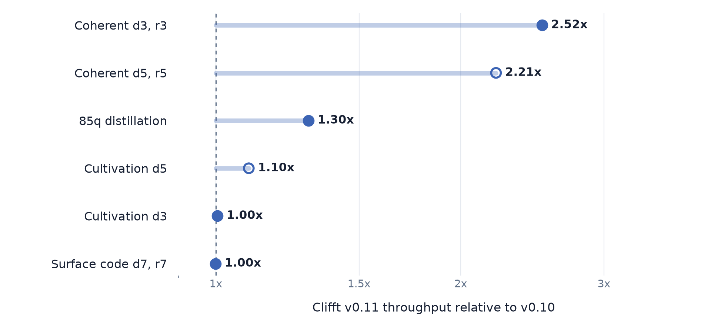
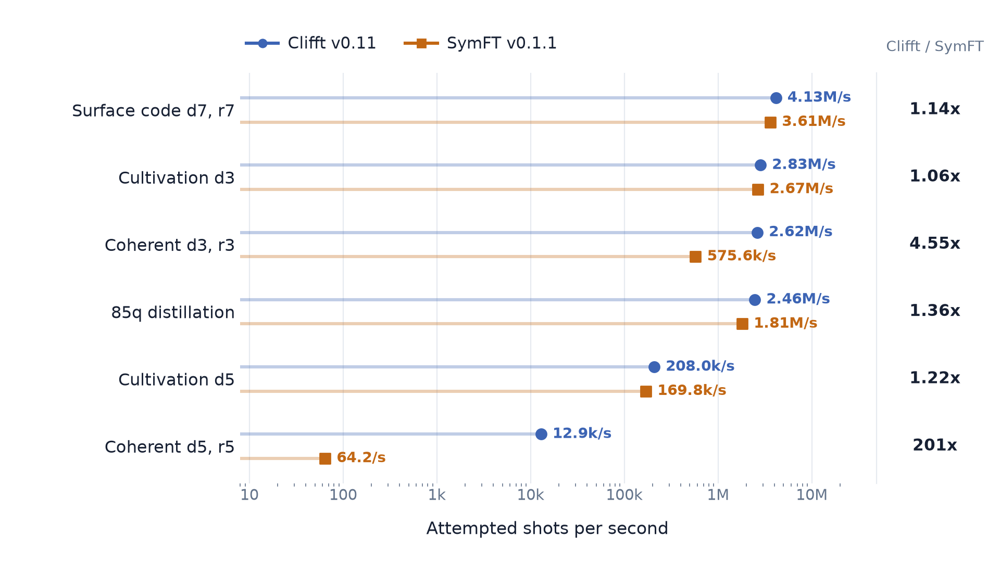

# clifft-bench

Reproducible performance benchmarks for
[Clifft](https://github.com/unitaryfoundation/clifft) and comparable
near-Clifford circuit simulators.

This repository tracks Clifft's performance across releases and compares it
with other simulators on the same workloads. It contains the benchmarks,
reviewed results, and scripts that generate the figures below.

Looking to use Clifft? Start with the
[Clifft documentation](https://unitaryfoundation.github.io/clifft/stable/).

## Regular release questions

See the [Performance guide](https://unitaryfoundation.github.io/clifft/stable/guide/performance/)
for interpretation, methodology, and longer-term performance history.

These figures use the reviewed
[Clifft 0.11.0 release-candidate results](results/release-v1/release-v1-20260930-180134/).
Plot labels show the intended release versions; the measurements used
0.11.0rc1 with active-width scheduling and the 0.10.0rc1 baseline, with batch
size calibrated independently for each workload and implementation.

### Did Clifft get faster in the latest release?

<picture>
  <source media="(prefers-color-scheme: dark)" srcset="reporting/figures/web/v011-vs-v010-dark.png">
  
</picture>

### How does Clifft compare with other simulators?

<picture>
  <source media="(prefers-color-scheme: dark)" srcset="reporting/figures/web/clifft-symft-throughput-dark.png">
  
</picture>

## Reproduce or contribute

- [Regenerate the figures](reporting/README.md) from checked-in results.
- [Collect release benchmarks](docs/manual-ec2.md) on the reference EC2 host.
- [Contribute](CONTRIBUTING.md): local development, release setup, and new workloads.
- [Explore other experiments](experiments/README.md), including
  [Quantum Volume comparisons](experiments/qv/README.md) and the
  [Tsim GPU study](experiments/tsim-gpu/README.md), with results pushed back from the GPU host,
  and the [whole-machine CPU comparison](experiments/whole-machine/README.md).
