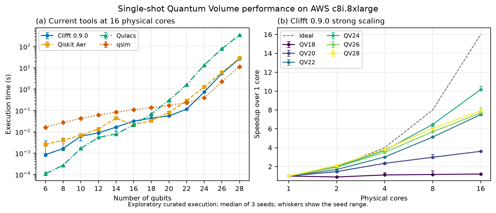

# QV multicore campaign

This occasional campaign answers two questions that do not fit the single-core
QEC throughput suite:

1. How does Clifft 0.9.0 single-shot latency compare with Qiskit Aer, Qulacs,
   and qsim at a fixed 16-physical-core budget?
2. How does Clifft's intra-shot OpenMP implementation scale from 1 to 16
   physical cores on wide Quantum Volume circuits?

It retains the workload and timed regions from the original Clifft paper's
[`qv_bench`](https://github.com/unitaryfoundation/clifft-paper/tree/main/qv_bench).
Clifft compilation plus one sample is timed; the other adapters retain their
original backend-execution timing boundaries. Circuit generation, QASM
conversion, imports, and process startup are outside the timed region.

## Campaign matrix

The official manifest contains 234 serial cases in one placement:

- 144 current-tool cases: four tools, QV6 through QV28 in steps of two, three
  deterministic circuit seeds, and 16 physical cores;
- 90 Clifft scaling cases: QV18 through QV28, three seeds, and 1/2/4/8/16
  physical cores.

The current Clifft run is built from the exact 0.9.0 release commit with
OpenMP enabled.

For a later Clifft release, update only the current release environment and the
two Clifft run identities. Keep the circuits, other tools, host epoch, and
measurement policy unchanged. A later external-tool release similarly changes
only that tool's isolated lock and run identity.

Each `(tool, width, seed, thread count)` case runs in a fresh subprocess. One
logical CPU is selected from each physical core, the process is bound to that
set, and OpenMP/BLAS thread budgets are set before simulator imports. The QASM
artifact for a `(width, seed)` pair is generated once and reused byte-for-byte
by every tool. Circuit generation uses the original paper's Qiskit 2.3.1
dependency closure; the Qiskit Aer simulator run uses the separately pinned
current Qiskit environment.

## Dedicated EC2 host

Create and retain a second stopped instance rather than resizing the QEC host:

- Canonical Ubuntu Server 24.04 LTS, 64-bit x86;
- `c8i.8xlarge` (32 vCPUs, 16 physical cores, 64 GiB RAM), On-Demand,
  shared tenancy;
- one fixed region and availability zone for the hardware epoch;
- 30 GiB `gp3` root EBS volume at default IOPS/throughput;
- IMDSv2 required and instance-initiated shutdown behavior set to **Stop**;
- no additional file system, IAM role, Elastic IP, or other persistent public
  IPv4 allocation;
- SSH limited to your current IP or an equivalent console connection.

The account needs at least 32 Standard On-Demand vCPUs available in the chosen
region. The campaign verifies the instance type, 16 physical/32 logical CPUs,
AMI, region, AZ, lifecycle, clean source commit, and a new boot ID for every
placement.

Per the [EC2 instance lifecycle documentation](https://docs.aws.amazon.com/AWSEC2/latest/UserGuide/ec2-instance-lifecycle.html),
stopped instances do not accrue EC2 compute charges. Their EBS volume still
does: in a region with the example `gp3` rate on the
[EBS pricing page](https://aws.amazon.com/ebs/pricing/) of $0.08 per GB-month,
a 30 GiB root volume is about $2.40/month. Keep the automatically assigned
public address ephemeral; AWS charges for allocated public IPv4 addresses as
described in the
[Elastic IP documentation](https://docs.aws.amazon.com/AWSEC2/latest/UserGuide/elastic-ip-addresses-eip.html),
so an Elastic IP would be a larger idle cost than this volume.

The two-instance convention is:

| Instance | Campaigns | Root volume | State between campaigns |
|---|---|---:|---|
| `m7a.xlarge` | QEC history/current tools | 16 GiB gp3 | Stopped |
| `c8i.8xlarge` | QV multicore | 30 GiB gp3 | Stopped |

## Collection

Use the same playbook commands as the QEC campaigns:

```bash
export CLIFFT_BENCH_CAMPAIGN=qv-multicore-v1
./scripts/ec2/bootstrap.sh "$CLIFFT_BENCH_CAMPAIGN"
```

Bootstrap compiles Clifft 0.9.0 with a 64-qubit build limit and
`CLIFFT_OPENMP=ON`, so missing compiler
support fails immediately rather than silently producing a serial build.

Then collect the single placement:

```bash
export CLIFFT_BENCH_EXECUTION=qv-multicore-v1-YYYYMM
./scripts/ec2/run-placement.sh \
  "$CLIFFT_BENCH_CAMPAIGN" \
  "$CLIFFT_BENCH_EXECUTION" \
  1
```

Each case has a 10 GiB address-space limit and a 10-minute timeout. The whole
placement has a 150-minute launcher ceiling, while the existing eight-hour
shutdown guard remains the final cost backstop. Timeouts and tool failures are
retained as structured case evidence.

After placement 1, finalize and push exactly as in the main manual playbook:

```bash
./scripts/ec2/finalize.sh \
  "$CLIFFT_BENCH_CAMPAIGN" \
  "$CLIFFT_BENCH_EXECUTION"
```

Finalization commits the byte-identical QASM corpus, raw JSON, a long-form
`cases.csv`, and a compact summary. Plotting can compare isolated tool runs by
`run_id`, width, seed, thread count, placement, and hardware epoch without
changing how measurements are collected.

## Collected result



[Publication PDF](../figures/qv-multicore-v1-2026082.pdf)

The left panel retains the original paper's log-scale latency comparison. The
right panel keeps the Clifft thread-scaling cases separate and reports paired
per-seed speedup over one physical core. The figure is labeled exploratory
because it uses the curated execution described in its raw provenance.
Regenerate both the publication PDF and the GitHub-preview PNG with:

```bash
uv run --extra plot python scripts/plot_qv.py
```
