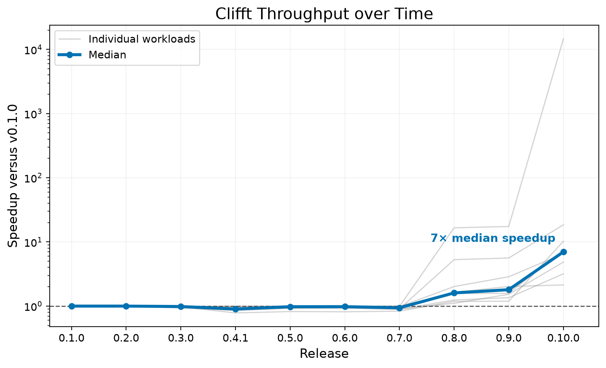
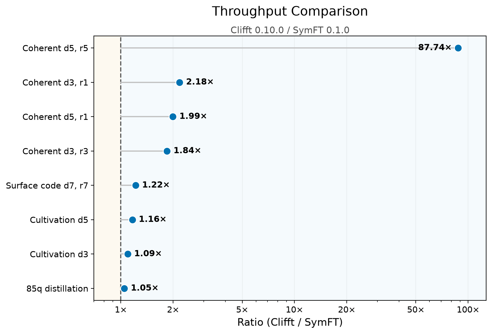
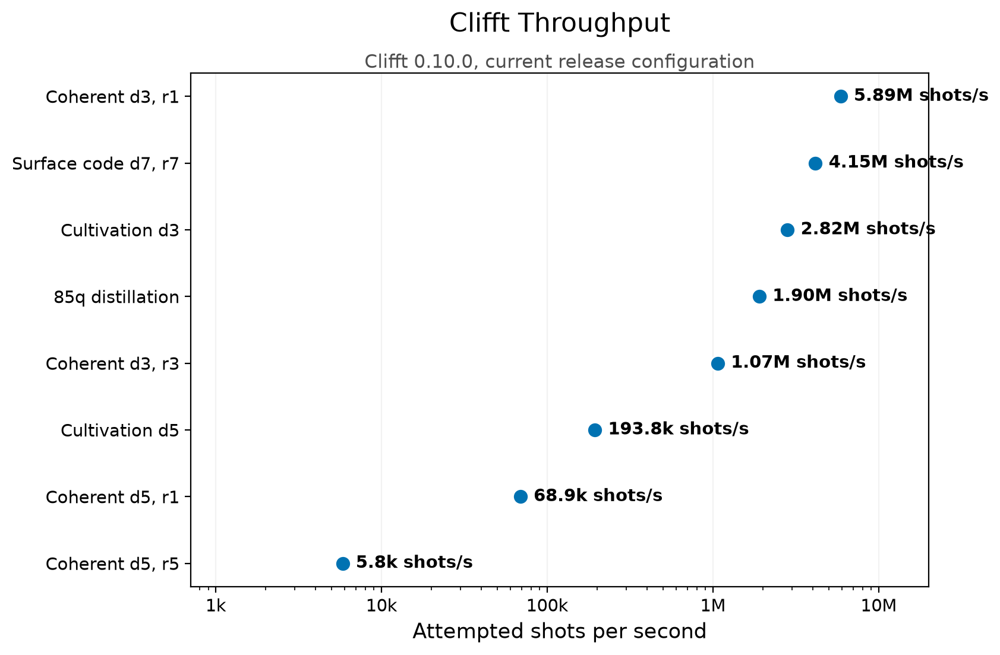

# QEC performance reporting

This directory combines reviewed, finalized campaign outputs into three stable
downstream figures:

- `figures/clifft-performance-over-time.png` shows each workload's throughput
  relative to Clifft 0.1.0 and the median across workloads.
- `figures/clifft-vs-symft.png` compares the latest calibrated Clifft and SymFT
  configurations for each workload.
- `figures/clifft-throughput.png` shows the latest calibrated Clifft's absolute
  attempted-shot throughput on a logarithmic scale.

## Current figures







Generate them from the repository root:

```bash
uv run --extra report python reporting/qec.py
```

Validate source selection and the reporting joins without rendering:

```bash
uv run --extra report python reporting/qec.py --check
```

Pass `--pdf` to also write publication-oriented vector PDFs. The PNGs are
checked in so they can be reviewed alongside a reporting change.

## How executions are combined

The release-history execution supplies the scalar 0.1.0 through 0.9.0 points.
Later points are chained from the recurring release campaign's paired
`current-vs-previous` ratios. For example, the 0.10.0 speedup for each workload
is its historical 0.9.0/0.1.0 speedup multiplied by the corrected release
campaign's calibrated 0.10.0/0.9.0 ratio. This uses the paired previous-release
anchor instead of interpreting absolute throughput differences between EC2
boots as product changes.

[`sources.json`](sources.json) declares the exact reviewed executions used by
the figures. After a later release is collected, append its execution path in
version order and regenerate. If a release pair is corrected, replace that
entry with the corrected execution; the underlying evidence remains preserved.

The latest execution's `alternatives-vs-current` rows supply the relative-tool
plot. The script verifies that they reuse exactly the same calibrated current
Clifft cases as `current-vs-previous`, that all eight workloads are present,
and that both sides use equal `shots_per_call` values. Public labels use the
recorded display versions, while exact release-candidate identities remain in
the underlying results.
